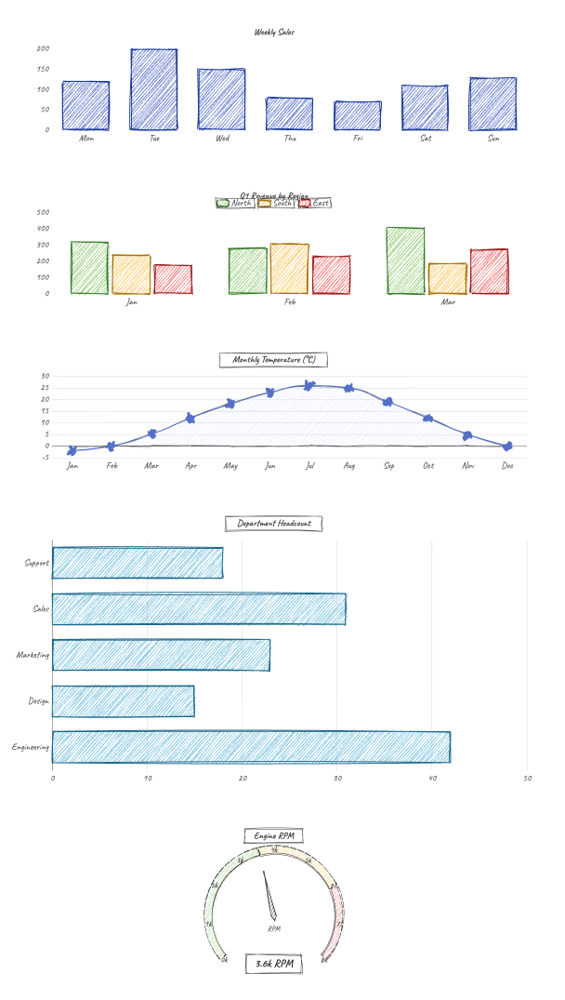

# experimental-echarts-roughjs

A custom [zrender](https://github.com/ecomfe/zrender) painter that renders [Apache ECharts](https://echarts.apache.org/) charts in a hand-drawn, sketchy style using [Rough.js](https://roughjs.com/).



## How it works

ECharts uses zrender as its rendering engine. zrender has a pluggable painter system: you can register a custom painter with `registerPainter(name, PainterClass)` and then pass `{ renderer: name }` to `echarts.init()`.

This project implements a custom painter (`src/rough/`) that sits between zrender and Rough.js:

```
ECharts (chart logic)
  └─ zrender (scene graph, layout, animation)
       └─ RPainter  ← custom painter (this project)
            └─ Rough.js  ← sketchy canvas renderer
```

### Painter pipeline

1. **`RPainter`** (`Painter.ts`) — implements `PainterBase`. Manages canvas layers and drives the render loop, closely following zrender's built-in `CanvasPainter`.

2. **`brush()`** (`graphic.ts`) — the core render function. For each `Displayable` element in the sorted display list it:
   - Applies canvas transform (`setContextTransform`)
   - Handles clip paths (`updateClipStatus`)
   - Dispatches to `brushPath`, `brushText`, or `brushImage`

3. **`brushPath()`** — converts a zrender `Path` to an SVG path string via `SVGPathRecorder`, then hands it to `rough.canvas(canvas).path(svgPath, opts)`.

4. **`SVGPathRecorder`** — a duck-typed canvas context that intercepts `PathProxy.rebuildPath()` calls and records commands as SVG path data (`M`, `L`, `C`, `Q`, `A`, `Z`).

5. **`Layer`** (`Layer.ts`) — thin wrapper around an `HTMLCanvasElement`, mirrors zrender's canvas layer concept.

### Roughness heuristic

Filled shapes (bars, area fills) get a full sketchy treatment; stroke-only paths (axes, grid lines, tick marks) use minimal roughness to stay legible:

```ts
roughness: hasFill ? 1.5 : 0.4,
bowing:    hasFill ? 1   : 0.3,
```

## Demo

Five ECharts chart types, all rendered through the rough painter:

| Chart | Description |
|---|---|
| Bar | Weekly sales, single series |
| Grouped bar | Q1 revenue by region, three series |
| Line + area | Monthly temperature, smooth curve |
| Horizontal bar | Department headcount |
| Gauge | Engine RPM speedometer |

The [Caveat](https://fonts.google.com/specimen/Caveat) handwriting font is applied via ECharts `textStyle` options (CSS `font-family` has no effect on canvas text).

## Getting started

```bash
npm install
npm run dev
```

Open http://localhost:5173.

```bash
npm run build   # production bundle → dist/
npm run preview # preview the build
```

## Project structure

```
src/
  rough/
    index.ts       registerPainter('rough', RPainter)
    Painter.ts     PainterBase implementation
    Layer.ts       Canvas layer wrapper
    graphic.ts     SVGPathRecorder + brush functions (core)
    helper.ts      getSize(), gradient helpers
    dashStyle.ts   Line dash normalisation
  App.jsx          Demo: 5 charts with opts={{ renderer: 'rough' }}
  main.jsx         React entry point
```

## Limitations

- **Gradients and image patterns** are not passed to Rough.js (it only accepts plain colour strings). Gradient fills fall back to `'none'`.
- **Animation** works for shape and opacity tweens driven by zrender's animation loop, but clip-path based animations (e.g. line chart reveal) are not applied — paths render at their full geometry immediately.
- **Interactivity** (hover, tooltip axis pointer) uses the standard zrender `HandlerProxy` on top of the rough canvas, so tooltips work out of the box.

## Dependencies

| Package | Role |
|---|---|
| `echarts` | Chart library |
| `echarts-for-react` | React wrapper for ECharts |
| `roughjs` | Sketchy canvas rendering |
| `react` / `react-dom` | UI framework |
| `vite` | Build tool |
